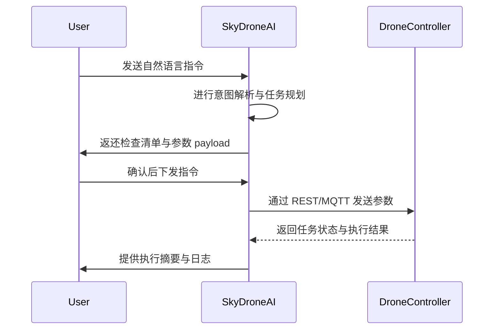

# AI Chatbot Specification (SkyTrust Drone Assistant)

本文件定义面向 SkyTrust Drone 的 AI Chatbot 体系，包括对话流程、参数格式、通信接口以及安全机制等，确保机器人在复杂场景下的可控性、可审计性与可扩展性。

## 1) Typical conversation flow（典型对话流程）
- Step 1: User input（用户输入）: 自然语言指令或需求，例如 "survey area B for NFZ"、"start delivery to point X"。
- Step 2: AI reasoning chain（AI 推理链）: 解析意图、检查安全性、规划航线与任务参数，记录 Reasoning Logs。
- Step 3: Output（输出）: 给出一个 Checklists 列表以及 Drone Params Payload，用于执行下一步动作。
- Step 4: Action（执行）: 调用 REST/MQTT 接口下发任务，返回执行状态与任务ID。
- Step 5: Feedback（反馈）: 系统回传执行结果与状态。

示例：
- Checklists: [Verify NFZ, Validate battery, Check weather window]
- Drone Params: { flight_plan, safety_params, mission_context }

## 2) Flight parameter format compatible with DJI MSDK（DJI MSDK v5 对接）
- FlightPlan + SafetyParams（伪 JSON，供参考），最终将映射到 FlightController 指令。
- 示例 Payload（JSON-flavored）:
```json
{
  "drone_id": "SKY-DRONE-01",
  "flight_plan": {
    "mode": "GPS",
    "max_altitude_m": 120,
    "speed_mps": 6,
    "waypoints": [
      {"lat": 37.7749, "lon": -122.4194, "altitude_m": 100},
      {"lat": 37.7755, "lon": -122.4180, "altitude_m": 100}
    ],
    "heading_deg": 0
  },
  "safety_params": {
    "geo_lock": true,
    "hover_timeout_ms": 5000,
    "return_to_home_if_fail": false
  }
}
```
注：该结构体用于上层应用层与 DJI MSDK 的对接，具体参数名和字段需在实现阶段对接官方 SDK API。

## 3) Parameter delivery interface draft（参数派发接口草案）
- REST：POST /api/drone/params
- MQTT：topic: drone/{drone_id}/flight_plan，payload 为上述 JSON；状态回执在 drone/{drone_id}/status 主题返回。
- 指令幂等性：同一 correlation_id 的请求应重复执行且无副作用。
- 错误处理：返回规范化错误码，带有可追踪的 correlation_id。

## 4) Danger command secondary confirmation flow（危险指令二次确认流）
- 场景：超视距（BVLOS）、高风速（wind gusts）或低电量触发的风险操作。
- 流程：
  1) 系统检测风险，生成风险分数与建议动作。
  2) 向操作者呈现风险摘要与可选方案，要求二次确认。
  3) 若操作者确认，进入增强安全检查（备用航线、额外电量余量、降落备援点等），继续执行。
  4) 若操作者取消，回退到安全状态（Hover、RTH 等）。
- 确认信息包括：风险分数、BVLOS 半径、应急出口点、以及电量余量。

## 5) Logging format for accident auditing（事故审计日志格式）
```json
{
  "log_id": "LOG-20260502-001",
  "timestamp": "2026-05-02T12:34:56Z",
  "drone_id": "SKY-DRONE-01",
  "flight_id": "FLIGHT-20260502-001",
  "event": "ACCIDENT",
  "parameters": {
    "flight_plan": {"mode": "GPS", "altitude": 120},
    "safety_params": {"geo_lock": true}
  },
  "outcome": "IN_PROGRESS_OR_DERIVED_ACTION",
  "notes": "Partial loss of GNSS; BVLOS attempted with BVLOS confirmation"
}
```

## 6) Flow diagram（Mermaid）


## 7) Security & safety considerations（安全性与合规）
- 认证与授权：所有 API 调用需携带 Access Token，MQTT 使用证书或基于 TLS 的认证。
- 数据最小化：对话、参数与日志不应包含敏感个人信息。
- 审计日志：对关键决策和动作进行不可篡改的日志记录。
- 错误恢复：网络中断时保持操作幂等性与状态可追踪性。

## 8) Flow control & reliability（流程控制与鲁棒性）
- 状态机：Idle -> Planning -> Execution -> Hover/Stop -> Recovery。
- 超时控制：任何阶段超过设定时间需进入安全态（Hover 或 RTH）。
- 跨系统容错：如果云端不可用，设备端应继续在本地执行有限自检与 NFZ 监控。

## 9) Data formats & schemas（数据格式与模式）
- ConversationContext：对话状态、意图、信心、以及对话历史。
- DroneParams：同 DJI MSDK 参数对接结构，含 flight_plan、safety_params。
- Logs：统一的审计日志结构，包含时间戳、事件、参数、执行结果。

## 10) Verification plan（验证计划）
- 单元测试：对话理解、参数组装、命令下发、错误码处理。
- 集成测试：前端输入、后端 API、设备端执行、以及云端日志聚合。
- 安全测试：Token 验证、证书轮换、以及异常情况下的回滚策略。
- 性能测试：对话到执行的延迟、参数传输带宽与吞吐。

## 11) Extended conversation examples and integration details（扩展对话示例与集成细节）
- 示例 1：复杂任务组合、NFZ 调研与物流派单的多轮对话。
- 示例 2：紧急情况的快速决策流程、以及与地面人员的人工确认链。
- 示例 3：任务取消与资源回收的协调。

## 12) Audit readiness & logging schema（审计就绪与日志架构）
- 日志字段：event_type、timestamp、source、drone_id、user_id、payload、outcome、trace_id。
- 日志存储策略、不可变性、以及归档流程。

结论：Chatbot 规格在此版本中实现了核心对话、参数、接口和审计能力，后续将结合实际实现完善接口细节与测试用例。
