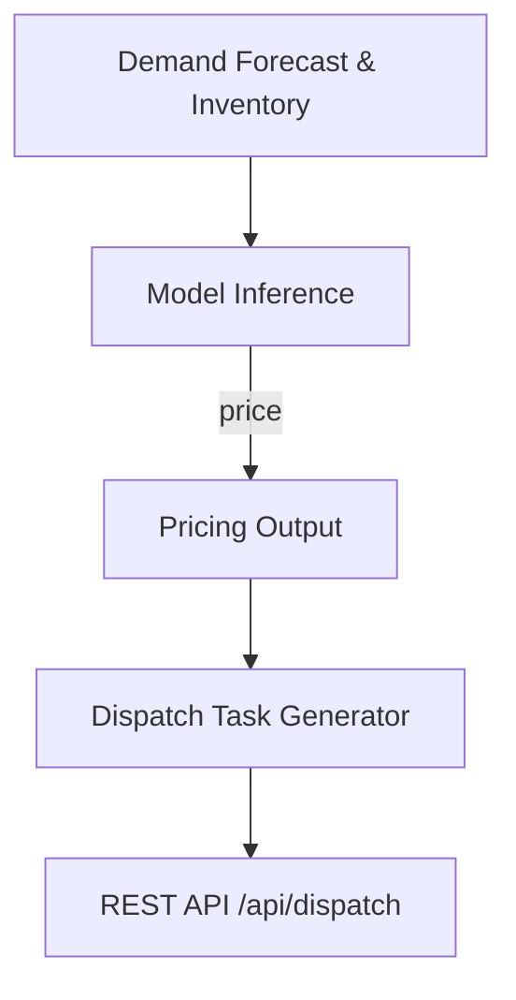

# AI Pricing & Dispatch Specification (SkyTrust)

本文件提供关于定价策略、需求预测与派单调度的完整规格，以支持 Spring Boot 2.7.15 后端与前端服务的对接。内容涵盖特征工程、模型选型、价格边界、REST API 示例、派单伪代码、以及数据隐私等要点。

## 1) Feature engineering（特征工程 – 10+ 特征）
下列特征用于支撑需求预测与动态定价，所有特征均应避免泄露用户个人身份信息（PII）。
| Feature Name | Description | Data Type | Source | 示例 |
|--------------|-------------|-----------|--------|------|
| demand_forecast_region | 区域级需求预测分数 | float | 历史订单、天气、事件 | 0.72 |
| weather_window | 未来可用天气窗口（小时） | float | 天气服务 | 3.5 |
| historical_orders_30d | 最近 30 天历史订单总量 | int | 订单数据 | 128 |
| time_of_day | 小时（0-23） | int | 时间戳 | 14 |
| day_of_week | 周几 | int | 日历 | 2 |
| holidays_flag | 是否假日 | bool | 日历 | false |
| inventory_level | 库存/设备可用量 | int | 库存系统 | 45 |
| drone_availability | 航空队列可用性指数 | float | 运维数据 | 0.92 |
| operator_response_time | 操作员平均响应时间（s） | float | 运维记录 | 2.1 |
| battery_health | 电池健康百分比 | float | 设备诊断 | 86.0 |
| no_fly_density | NFZ 密度/风险密度近邻 | float | NFZ 数据 + 地理 | 0.12 |
| market_competition | 市场竞争强度指示 | float | 市场分析 | 0.60 |
| weather_severity | 天气严重度（风速/降水） | float | 天气服务 | 0.25 |
| event_surge | 事件性需求激增指示 | float | 事件日历 | 0.0 |
| seasonality_index | 季节性指数 | float | 时序分解 | 0.5 |

> 注：特征应以区域/时段聚合为主，避免包含个人身份信息。

## 2) Models & comparison（模型比较）
- LSTM（Long Short-Term Memory）
  - 优点：擅长捕捉时序依赖，适合长序列预测。
  - 缺点：需要大量数据、训练成本高、对超参数敏感。
- XGBoost
  - 优点：对表格数据表现优异、训练快速、对缺失值鲁棒性好。
  - 缺点：天然非时序，需要通过特征工程引入时间信息。
- LightGBM
  - 优点：高效、内存友好、对大类别变量良好处理。
  - 缺点：同 XGBoost，需要外部时序处理来捕捉时间相关性。
- 对比总结：若数据量充足且时间依赖强，优先考虑 LSTM；若特征空间丰富且需要快速迭代，XGBoost/LightGBM 常表现更稳健。

## 3) Price bounds（价格上下限）
- 定价规则：
- min_price_bound = max(cost * 1.20, baseline_price * 1.20)
- max_price_bound = baseline_price * 3.00
- 约束：所有预测价格需落在 [min_price_bound, max_price_bound] 区间内。
- 解释：确保价格至少覆盖成本的 120%，且不超过常规价格的 300%，以避免价格波动过大。

## 4) REST API input/output（JSON 示例）
- 请求示例（价格预测）：
```json
{
  "region_id": "R-01",
  "timestamp": "2026-05-02T12:00:00Z",
  "features": {
    "demand_forecast_region": 0.75,
    "weather_window": 3.5,
    "historical_orders_30d": 128,
    "time_of_day": 12,
    "day_of_week": 3,
    "holidays_flag": false,
    "inventory_level": 45,
    "drone_availability": 0.92,
    "operator_response_time": 2.1,
    "battery_health": 86,
    "no_fly_density": 0.12,
    "market_competition": 0.6,
    "weather_severity": 0.2,
    "event_surge": 0.0,
    "seasonality_index": 0.5
  }
}
```
- 回应示例（价格预测结果）：
```json
{
  "region_id": "R-01",
  "recommended_price": 180.0,
  "confidence": 0.78,
  "currency": "USD",
  "valid_until": "2026-05-02T14:00:00Z",
  "price_bounds": {
    "min": 216.0,
    "max": 540.0
  }
}
```

## 5) Dispatch task generator（派单伪代码 Input/Output）
- Input：demand_forecast, inventory
- Output：dispatch_tasks，包含 base_id、device_id、task_type、time_window 等字段。

```python
def generate_dispatch_tasks(demand_forecast, inventory, devices, horizon_hours=4):
    tasks = []
    base_id = int(time.time())
    for d in devices:
        available = d.capacity > 0 and not d.in_maintenance
        if not available:
            continue
        task = {
            "base_id": f"{base_id}-{d.id}",
            "device_id": d.id,
            "task_type": "delivery" if demand_forecast > 0.5 else "recon",
            "time_window": {
                "start": now_iso(),
                "end": add_hours(now(), horizon_hours)
            }
        }
        tasks.append(task)
    return tasks
```

## 6) Flow diagram（Mermaid）


## 7) Data privacy（数据隐私）
- 不在预测特征中包含个人可识别信息（PII）。
- 使用聚合/脱敏的区域级特征。
- 模型、日志、和结果都进行访问控制和审计日志记录。
- 日志轮换与数据留存符合公司合规要求。

## 8) Evaluation & monitoring（评估与监控）
- 指标：MAE、RMSE、MAPE、价格波动度、命中率、覆盖率等。
- 监控：在线 A/B 测试、漂移检测、模型重训窗口设置。
- 异常处理：对突然的需求爆发和异常天气进行快速回滚策略。

## 9) API design tips（接口设计要点）
- RESTful /api/pricing/generate、/api/pricing/forecast、/api/dispatch
- 输入校验、版本控制、错误码与错误消息。
- 安全性：认证、授权、参数签名等。

## 10) Privacy & compliance（隐私合规）
- 特征设计遵循最小化原则，不包含用户 PII。
- 数据传输与存储采用加密与访问控制。
- 数据保留策略遵循相关法规与公司政策。

总结：上述规格提供了完整的定价与派单框架，后续将逐步实现 API、服务端模型训练、以及与现有 Spring Boot 服务端的集成。
